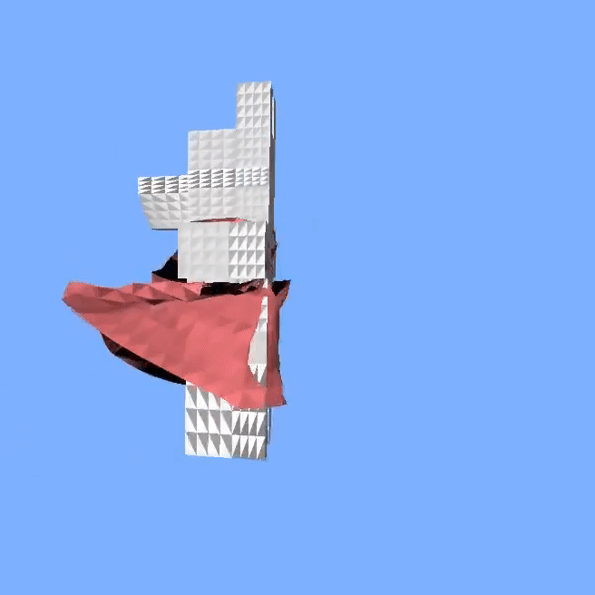
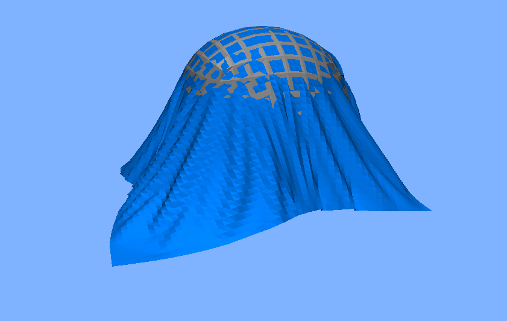
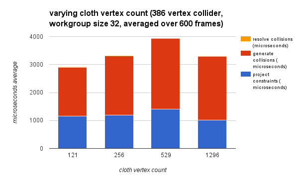
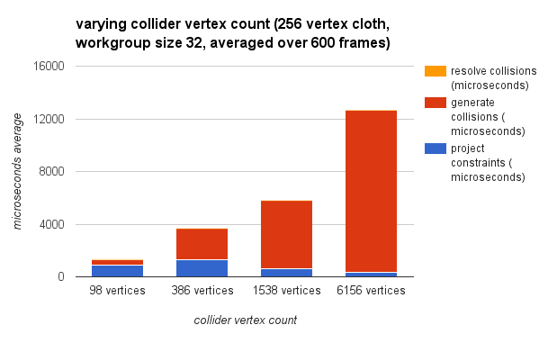
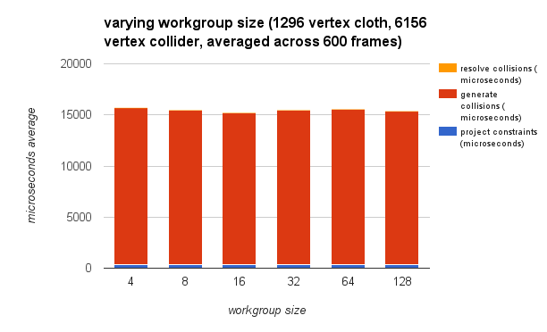
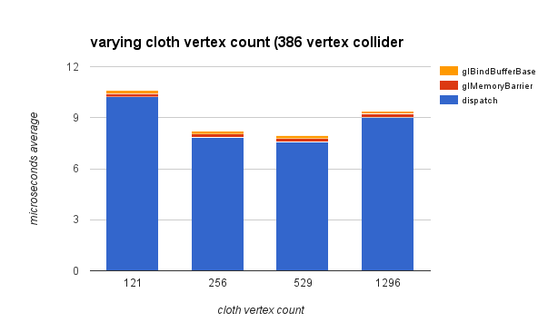
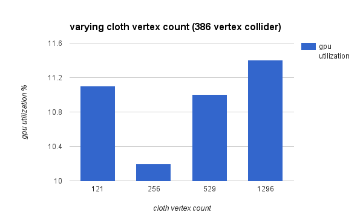
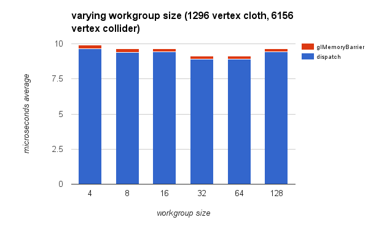
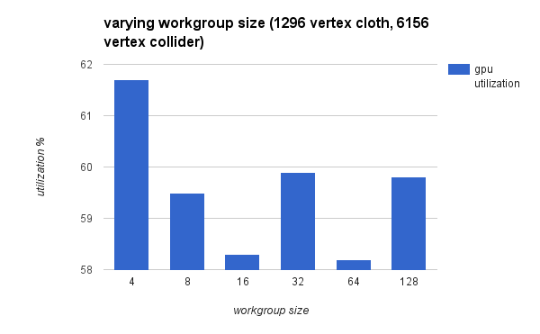

# GPU cloth with OpenGL Compute Shaders

This project in progress is a PBD cloth simulation accelerated and parallelized using OpenGL compute shaders.
For a quick project overview, see slides [here](https://docs.google.com/presentation/d/10NuqXlJcnySN1iwSSfF_0jpzQrNrDT12sbKtzZ99fFk/edit?usp=sharing).
For more details on the project milestones and development during the semester, see the [milestone slides](https://docs.google.com/presentation/d/1t7K-MafQH_8fw7R2KPMy-iOtFBdPRJSsHp4oSA9XR0c/edit?usp=sharing).

## Work-In-Progress Video

## Contents
- Brief overview of PBD and OpenGL Compute Shaders
- Simulation pipeline overview
- Performance Analysis
- Tips and Tricks
- Milestones (in reverse chronological order)

## PBD and OpenGL Compute Shaders

PBD stands for [Position Based Dynamics](http://matthias-mueller-fischer.ch/publications/posBasedDyn.pdf) and is one method amongst many for simulating cloth as a series of interconnected vertices. Most other systems are mass-spring systems and use forces to compute the trajectories of the cloth particles over time, but this can get extremely unstable with large timesteps - for example, the forces acting on a point in the cloth may cause it to overextend its "springs," so that in the next timestep an even larger force attempts to correct this, causing it to overextend in another direction... and so on.

Position Based Dynamics directly manipulates vertex positions and velocities to ensure that the simulation stays stable. However, the difference is mostly in the "solver" that corrects positions, velocities, etc. - from a datastructures point of view a PBD simulation looks a lot like any other cloth simulation. It will consist of a series of points and a series of edges, and the solver will look at each to determine what to do with the points.

Since solving a cloth system structured like this involves running a similar computation for many different vertices, it seems intuitively like a problem that can be accelerated by massive parallelism on a GPU. OpenGL compute shaders are one way of doing this - they allow users to perform parallelized computation on data outside the usual shading pipeline. It's meant for similar problems as Nvidia's CUDA but can be used on a wider variety of hardware systems. Also, OpenGL compute shaders and the normal OpenGL shading pipeline can use the same buffers without much fuss, which is a really nice bonus for computer graphics simulations.

## Simulation Pipeline overview
My pipeline primarily works on "vertices" and "constraints," all of which are packed into vec4s in various ways.
Vertices are generally laid out as [x, y, z positions, inverse mass].
Constraints come in two varieties:
- stretch constraints: [index of position to be constrained, index of constrainer, rest length, SSBO ID]
	- the SSBO ID and indices allow this constraint to act as a "pin" as well as a spring constraint
	- a negative rest length signals that a constraint is a "pin"
	- this simulation supports pinning cloths to moving rigidbodies
- collision constraints: [normal of collision point, parametric distance to collision point]

I broke down each PBD "stage" into its own shader, along with a few more. They are as follows:

1. compute the influence of external forces on each vertex's velocity
  * parallelized by vertex
2. damp the velocities
  * currently only basic damping, a multiplier on linear velocities
  * damping that preserves rotational momentum would probably require compute shader stream compaction, a whole additional stage
  * parallelized by vertex
3. generate position predictions for PBD to fix based on the updated velocities
  * parallelized by vertex
4. update masses to conform with constraints
  * vertices that are "pinned" are given "infinite mass," or 0 inverse mass
  * this way they cannot be moved by their other spring constraints
5. use PBD to "fix" the positions for some number of repititions
  * parallelized by constraint - in my current system each cloth particle may be influenced by up to 8 such constraints
6. generate and resolve collision constraints
  * parallelized by vertex - each vertex may only have a single collision constraint at a given time
7. update the positions and velocities for the next time step
  * parallelized per vertex

## Performance Analysis

**January 17, 2015**

I modified my data collection methods! The simulation class now contains code for using OpenGL Timer Queries to assess how long different PBD stages take to run. This code is heavily based off of the method described at [lighthouse3d](http://www.lighthouse3d.com/tutorials/opengl-timer-query/).

As before, I ran 3 types of tests:
- vertex count in a cloth
- vertex count in a collider
- work group size

This time I gathered runtimes for the position correction, collision detection, and collision resolution stages. All tests averaged results over the first 600 frames of computation.

The data collected by OpenGL Timer Queries seems to make more sense than what was gathered before via NSIGHT: as expected, increasing vertex counts for either the rigidbody collider or the cloth increases the computation time overall, with increases to the rigidbody collider size generating the most noticeable increase - likely due to the enormous amount of memory access in the current naive collision detection implementation.

However, note that the amount of time taken to perform position correction decreases vastly between the "varying cloth" and "varying work group size" tests, even for all datapoints with work group size 32. This may be indicative of a measurement problem, as multiple calls are made to the position correction shader during the query.

Despite this apparent anomaly, the current data collection method seems to be satisfactory for documenting performance improvemnets moving forward with acceleration structures.

**December 11, 2015**

I performed 3 types of tests for performance analysis:
- vertex count in a cloth
- vertex count in a collider
- work group size
All data was collected from 20 seconds of simulation using Nvidia's profiler in NSIGHT for Visual Studio.
All testing was performed on Windows 10 64 bit on a GTX 970 GPU with 4 gigabytes of VRAM and an Intel i7 4790 CPU with 16 gigabytes of RAM. I collected data on time spent on the compute shader dispatch, time spent in memory barriers, and GPU utilization.

*Cloth Vertex Count*

PBD runs on each cloth vertex multiple times per frame, so I wanted to look at the difference in performance hits between increasing the cloth vertex cound and increasing the collider vertex count.

Unfortunately, the data does not really allow an immediately clear explanation, with performance in shader dispatch improving for the "middle" vertex counts before worsening again. In addition, the GPU utilization is even more puzzling in that apparently a 121 vertex cloth takes more resources to simulate than a 256 vertex cloth. More data and a more certain means of collecting said data would likely shed further light on this.

One noticeable trend, however, is that the time spent in memory operations in in memory barriers seems to be fairly consistent and minimal across different vertex counts. More data is needed to confirm this.

*Collider Vertex Count*

Varying the vertex count on the collider appears to also produce fairly consistent results across stages, this respite the fact that my collision detection is relatively naive and iteratively checks every triangle in the collider against each cloth vertex in parallel. The GPU utilization here partially makes more sense in that bigger collider meshes would doubtlessly take more resources to store and process.

*Collider Vertex Count*

Varying the work group size does not seem to produce a trend in the actual dispatch times, and once again the GPU utilization percentage is somewhat perplexing.

*Overall Analysis Notes*

It should be noted that the times recorded were all taken from NSIGHT's statistics on "time spent in the OpenGL API." This could mean that the time does not just include the time that the GPU takes to run a computation but also the additional time it takes to launch a compute shader invocation. If this is the case it is possible that these invocation launches are swallowing up the actual GPU compute times, resulting in the consistencies seen in dispatch times. This could also explain the seemingly trendless GPU utilization data.

## Tips and Tricks

### Compute Shader Caveats
I had to learn a couple things about compute shaders through perplexing bugs that I had not anticipated.
- shader storage buffer objects expect data provided in blocks of 4, which meant all data had to be uploaded as vec4s no matter if the shaders themselves interpreted data as vec3s or single floats.
	- this eventually proved to be helpful for storing constraints, as well as weights within positions
	- however, before I figured this out my positions would get rotated in unpredictable ways
- compute shader invocations operate on "incoherent" memory - that is, if a compute shader is launched that modifies some SSBO of data and another compute shader is launched right after, the second shader will not "wait" until the first is done with the SSBO before starting and possibly trying to use the data in that SSBO.  	- adding glMemoryBarriers resolves this problem
	- see milestone 3 for more details on the bug that led to this learning

### Getting around race conditions with parallelizing by constraint
I noted in the pipeline overview above that the stage at which a vertex is corrected by its constraints is parallelized by constraint. Naive parallelization creates a problem: if a vertex has 8 constraints and each is trying to apply a correction to it at the same time, which one wins? One solution would be memory locks or atomics. However, atomics in OpenGL are only available for integers, and memory locks create performance issues as they must be evaluated at runtime. The solution I came up with was to build 8 buffers of internal constraints for each cloth such that each buffer only contains constraints that work on different points. With large enough cloths, these 8 buffers would be large enough that each one alone would still saturate the GPU hardware while avoiding race conditions.

### Ping-Ponging buffers
PBD's constraints constrain a vertex by assessing the positions of its neighbors. However, simlar to above, consider a constraint solving a vertex that needs to look at a neighbore that some other constraints are solving in parallel. Whether or not this constraint will solve its vertex in the same way every time is thus uncertain - it might execute before or after the neighboring position has been corrected. An easy solution to this problem is simply to maintain a copy of unmodified positions at each solver iteration and use those unmodified positions to constrain each vertex.

## Project Presentation - 12/11/2015
[slides](https://docs.google.com/presentation/d/1fGabPMjATozz02SGecJLwdKp69wpPRkBqGUIn027k1M/edit?usp=sharing)

## Milestone 3 - 12/7/2015
[slides](https://docs.google.com/presentation/d/1OpCrZfxQcJsMGToeXmzwc1cdoZwTzvEy3AgFFTF1_hQ/edit?usp=sharing)

This week's tasks included:
- working on simulation stability
- getting collision detection and response started

### Notes
- one big reason for the instability last week was that one of my internal constraint buffers was getting filled with bogus values
- I was filling another buffer with bogus values after filling the internal constraint buffers, but I forgot to bind the "bogus buffer"
- so almost all my points were missing a whole constraint out of the 4 available at this time
- there is still an odd problem with coherence, though: using only shader stages that cause gravitational acceleration, a cloth in the X/Y plane (z-up world) quickly transforms into this instead of falling flat:

## Milestone 2 - 11/30/2015
[slides](https://docs.google.com/presentation/d/1S4NgARMeADFadHxYxQ_WwaJtJeHCqSJZSSER5r8drzc/edit?usp=sharing)

This week's tasks included resolving many of the problems in the previous week, namely:
- the problem with things in a single plane ending up in 3 planes
- improving rendering to make this more debuggable
- nailing bugs in the simulation pipeline

### Notes
- On the recommendation of [Harmony Li](https://github.com/harmoli) I switched the simulator to use PBD. There are still considerable stability problems
- Compute shaders expect shader storage buffers to act like vec4 buffers when data is being transferred, so transferring the positions as vec4s fixed the "planes" problem from last week

## Milestone 1 - 11/23/2015
[slides](https://docs.google.com/presentation/d/1CzXv1JUJpYXYMGLLSd8CTBg-UIMnl0YaXnWc5PCvoLs/edit?usp=sharing)

This week was mostly spent on reading up on compute shaders (found a lot of similarities with CUDA) and exploring/fixing the base code. I also put together a naive cloth simulation based on explicit symplectic integration, but it still needs considerable debugging.

### Notes
- for some reason, going from position buffers -> the vertex shader, many vertices seem to have their coordinate system modified to use a different axis as up. My hunch is there's something with the geometry shader
- in this example, all the vertex positions are only in the X/Z plane:

- compute shader atomics are only for integers, which could prove to be a problem
- it's hard to tell exactly how "wrong" the simulation is at the moment because of the issue in part 1
- this is a case in which slightly better rendering would vastly improve productivity in debugging

### added to the next milestone:
- rendering improvements: figure out how to render a cloth mesh instead of points, ground plane, lambert shading
- figure out what is happening with the geometry shader (or if that's even the problem)
- assess the simulation stability/"correctness"

### Done
- most of the "parts" of the simulation pipeline are in place
- added some camera controls to help with debugging